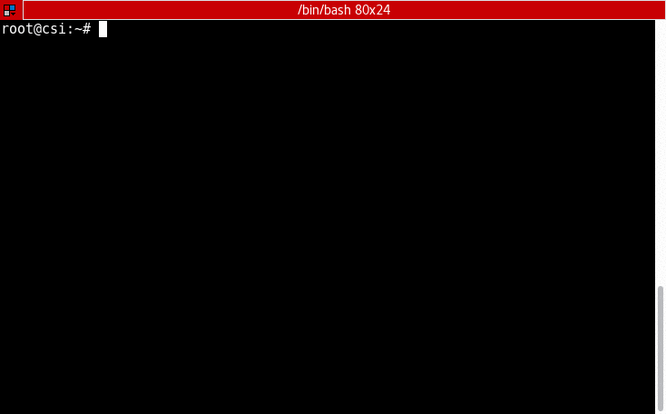

# Containers


Agora que estamos com ambiente configurado para executar Docker e o docker-compose, está na hora de colocar a mão na massa!


**Esse módulo é divido em:**

1. [Intrdução](#introdução)
2. [Hello World](#hello-world)
3. [Criando Containers](#criando-containers)

## Introdução

O docker é uma ferramenta para criar e gerenciar containers, que assim como o nome sugere, é um compartimento para armazenar e/ou transportar objetos, no nosso caso o compartimento é criado através de **virtualização** em que memoria e o processamento são separados para o uso do exclusivo do container.

É importante frisar que container **não é uma máquina virtual**, os containers utiliza-se do próprio kernel da máquina hospedeira, enquanto as máquinas virtuais também virtualizam o kernel. Com containers é possivel **isolar bibliotecas e binários** dentro do mesmo SO sem a necessidade de virtualizar um novo sistema.


## Hello World

Para verificar que seu ambiente está configurado de forma correta, basta executar o seguinte comando abaixo, se aparecer a mensagem `Hello from Docker!` tudo ocorreu bem:

```
docker run hello-world
```


Ao executar esse comando, nós chamamos o binário do docker, criamos um container a partir da opção ``run`` e dizemos que o container que será criado é da `imagem` ``hello-world:latest``. (vamos falar de imagens mais a frente).

## Criando Containers

Vamos agora criar um container que seja mais útil e a partir dele analisar os principais comandos de criação de um container. Vamos criar um container do **Node**. Para isso executem:

```
docker run -it node bash
```



Dessa vez criamos um cointaner passando o parametro ``-it`` além de adicionar um ``bash`` no final, o parametro it signifca que você ganhará um **terminal interativo** ao exectuar o container, caso você não coloque essa opção o container executará suas instruções e quando o **seu comando principal** terminar de executar ele irá morrer. O comando ``bash`` irá executar o comando do shell no container, então dessa forma conseguimos ter um **shell interativo dentro do container**.

Reparem que o hostname foi alterado, nesse momento estou dentro do container ``node:latest``, para verificar isso eu executei o comando ``node -v`` que me retornou a versão 10.11, enquanto que na minha máquina, como também pode ser notado, utilizo a versão 8.9 do node.

**O node que roda na minha máquina não tem relação nenhuma com o node do container**, com esse isolamento podemos trabalhar com diversos serviços que utilizam versões diferentes da mesma tecnologia sem que entrem em conflitos.
